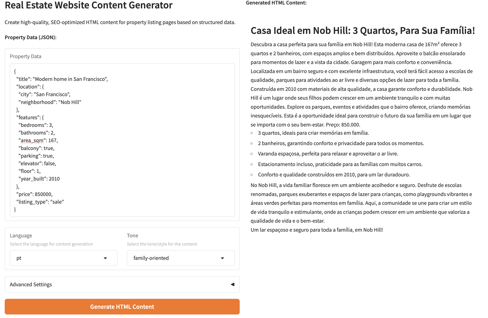

# 🏠 Real Estate: Website Content Generator

This project is a **Gradio web app** that generates **high‑quality, SEO‑optimized, multilingual content** for real estate property listing pages from structured property data.

It outputs JSON sections tagged by specific HTML elements so they can be integrated dynamically into a website template.

---

## 📘 Problem Statement

You have been hired by a real estate company that manages hundreds of property listings across different cities and regions. The company wants to automate the creation of high‑quality, SEO‑optimized, multilingual content for property listing pages on their website.

Your task is to build an AI‑powered system that generates all written content for these listing pages based on structured property data and a fixed content structure, with each section tagged by specific HTML elements so it can later be integrated dynamically into a website template.

---


## 📁 Project Structure

Key directories and files:
```bash
.
├── data                # Data folder
├── src                 # Code logic
├──── models            # Models definition and usage
├──── real_estate_app.py# Gradio + FastAPI app for Real Estate content
├── tests               # Dependencies
├── .flake8             # Linter config
├── .mypy.ini           # Type checker config
├── pyproject.toml      # Project definition
└── README.md           # Project overview
```

---

## 🛠️ Setup Instructions

This project uses [`uv`](https://github.com/astral-sh/uv) for Python dependency and environment management.

### Install `uv` and create venv (if not already)

```bash
curl -LsSf https://astral.sh/uv/install.sh | sh
uv venv
```

From there, UV will handle dependencies in the venv, according to pyproject.toml definition.

### Deploy models

The whole project uses models running locally with [`Ollama`](https://ollama.com/).

```bash
brew install ollama
ollama run **model_id**
```

Recommended models are:

- gemma3n:e2b
- gemma3:1b-it-qat

---


## ▶️ Run code
 
### main.py

There is a `main.py` example that triggers a sample run and writes outputs into `data/` for quick inspection.

```bash
uv run src/main.py
uv run src/plot.py
```

## 🖥️ Run app (Gradio UI)
 
### app.py

But the main goal should be to run the interactive app. The app is deployed locally with uvicorn on the port 5000. For that just run:

```bash
uv run src/app.py
```

After that, you should be able to navigate to:

[http://0.0.0.0:5000/realestate/](http://0.0.0.0:5000/realestate/)

You should see there an app like this:



**Note:** The UI currently focuses on structured inputs and content generation. Advanced parameters may be simplified.

## 🧹 Linters

The whole code follows PEP8, checks cyclomatic complexity and incorporates type hinting. It is highly recommended to check linters before deploying code or creating pull requests.

```bash
flake8 src
uv run mypy .
```

## 🧪 Tests

There are some sample tests that mainly check the models input / output. Those can be run with:

```bash
uv run pytest tests
```

---

## 🔗 References
[Gradio](https://www.gradio.app/)

---

## 🔒 License
This project is proprietary and intended for internal use only.
Unauthorized copying, modification, or distribution of any part of this project is strictly prohibited.